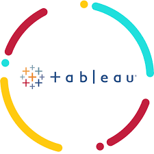
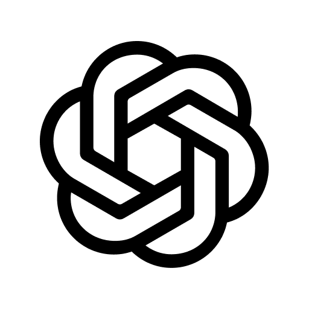
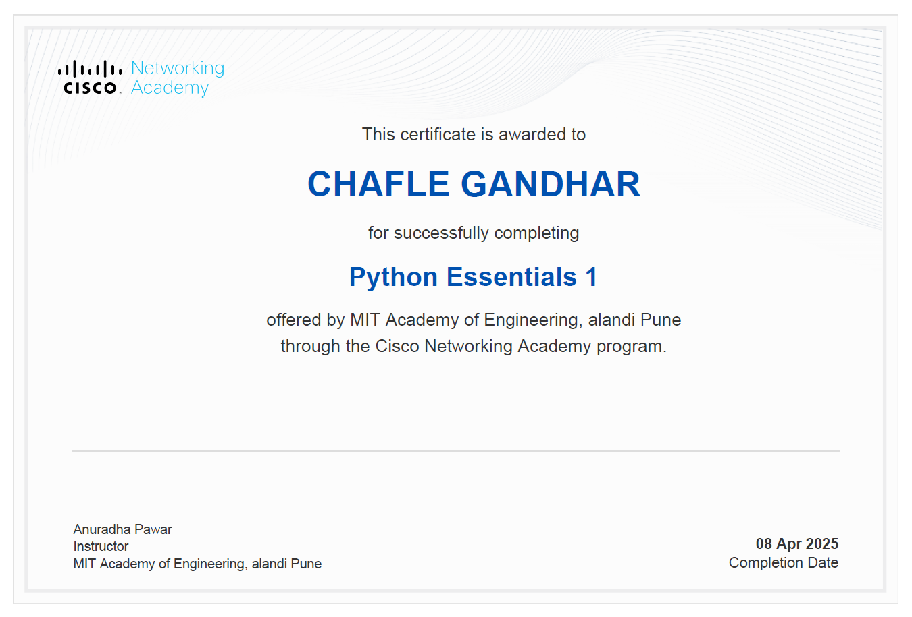

# Portfolio_Project

<!DOCTYPE html>
<html lang="en">
<head>
  <meta charset="UTF-8" />
  <meta name="viewport" content="width=device-width, initial-scale=1.0" />
  <title>My Portfolio</title>
  <link rel="stylesheet" href="Newcss.css" />
  
</head>
<body>
  

    <header>
      

        

          

          

          

        

        Gandhar
      

      
Next

      <nav class="nav-menu" id="navMenu">
        <a href="#home" class="nav-link">Home</a>
        <a href="#about" class="nav-link">About Me</a>
        <a href="#skills" class="nav-link">Skills</a>
        <a href="#projects" class="nav-link">Projects</a>
        <a href="#contact" class="nav-link">Contact Me</a>
      </nav>
    </header>

    <main>
      <section id="home" class="section active">
        <h1>Welcome to my portfolio</h1>
        
Explore my portfolio

      </section>

      <section id="about" class="section">
        <h2>About Me</h2>
        

          
          
Hello and welcome! I’m Gandhar Chafle, a first-year undergraduate student at the MIT Academy of Engineering in the Computer Science branch, specialising in Artificial Intelligence and Machine Learning with a keen interest. Hailing from the tranquil town of Wardha, I’ve built a strong academic foundation through dedication and curiosity, scoring 88.4% in my 10th and 81.67% in my 12th. My journey so far has been fueled by an eagerness to explore how intelligent systems shape our world, and I’ve actively pursued this passion by participating in competitive exams like CET, where I secured a 95.43 percentile. With a mindset geared toward innovation and continuous learning, I’m always looking for opportunities to grow and challenge myself.

          
Beyond academics, I find joy in tactical games that push my strategic thinking, diving into emerging technologies, and getting lost in the world of novels. I believe in learning through doing—be it exploring new programming paradigms, or analyzing real-world tech applications. My portfolio reflects not just my skills, but also my journey, experiments, and aspirations. Feel free to explore it, and get a glimpse into the mind of someone who’s not just preparing for the future, but helping shape it.

        

      </section>

      <section id="skills" class="section">
        <h2>Skills</h2>
        

          <h3>Apps</h3>
          

            
 Olabcub

            
 Tableau

            
 Orange

            
 ChatGPT

          

          <h3>Languages</h3>
          

            

              

                
C

                

              

            

            

              

                
C++

                

              

            

            

              

                
Python

                

              

            

            

              

                
SQL

                

              

            

          

        

      </section>

      <section id="projects" class="section">
        <h2>My Projects</h2>
        

          <h3 class="project-card">AI travel Agent</h3>
            
I developed an AI-powered chatbot assistant tailored for a travel company, designed to streamline customer interactions by providing instant support with itinerary planning, booking assistance, destination recommendations, and FAQs. This intelligent assistant enhances user experience by offering personalized and efficient responses, significantly reducing response time and increasing customer satisfaction.

          <h3 class="project-card">Hotel Data Analysing</h3>
            
Conducted a comprehensive analysis of a hotel management dataset to uncover key insights related to guest behavior, booking trends, occupancy rates, and revenue performance. Leveraged data visualization and statistical techniques to identify patterns such as peak booking periods, customer preferences, and factors influencing cancellations. The analysis provided actionable recommendations to optimize pricing strategies, enhance guest satisfaction, and improve operational efficiency.

          <h3 class="project-card">Dasboard on Toy company stats</h3>
            
Designed and developed an interactive dashboard to visualize key statistics for a toy company, enabling real-time insights into sales performance, inventory levels, customer demographics, and regional demand trends. The dashboard streamlined data interpretation for stakeholders, facilitating data-driven decisions to optimize product distribution, marketing strategies, and supply chain management.

            
        

      </section>

      <section id="contact" class="section">
        <h2>Contact Me</h2>
        <form>
          <label for="name">Name:</label>
          <input type="text" id="name" name="name" required />

          <label for="email">Email:</label>
          <input type="email" id="email" name="email" required />

          <label for="message">Message:</label>
          <textarea id="message" name="message" required></textarea>

          <button type="submit">Send Message</button>
        </form>
        

          
          
          
        

      </section>
    </main>

    <footer>
      

        
        
        
      

      
Website visit count: 0

    </footer>
  

</body>
</html>

#style.css

:root {
  --light-purple: #d8b4fe;
  --dark-purple: #4b0082;
  --white: #ffffff;
  --bg: #1a1a1a;
}

body {
  margin: 0;
  font-family: 'Segoe UI', sans-serif;
  background-color: var(--bg);
  color: var(--white);
  transition: all 0.5s ease;
}

h1, h2 {
  font-size: 70px;
  text-align: center;
  margin-bottom: 40px;
}

header {
  background: var(--dark-purple);
  padding: 15px;
  position: fixed;
  width: 100%;
  z-index: 1000;
  display: flex;
  justify-content: space-between;
  align-items: center;
}

.header-left {
  display: flex;
  align-items: center;
}

.hamburger {
  width: 30px;
  cursor: pointer;
  margin-left: 20px;
}

.bar {
  height: 4px;
  background: var(--white);
  margin: 5px 0;
  transition: 0.4s;
}

.my-name {
  margin-left: 15px;
  font-size: 22px;
  font-weight: bold;
}

.next-button {
  margin-right: 20px;
  background: var(--light-purple);
  color: var(--dark-purple);
  padding: 8px 16px;
  border-radius: 10px;
  cursor: pointer;
  font-weight: bold;
  transition: 0.3s;
}

.next-button:hover {
  background: var(--white);
}

.nav-menu {
  display: none;
  position: absolute;
  top: 60px;
  left: 10px;
  background: var(--dark-purple);
  padding: 15px;
  border-radius: 10px;
  flex-direction: column;
  animation: fadeIn 0.3s ease forwards;
}

.nav-menu a {
  color: var(--white);
  text-decoration: none;
  margin: 10px 0;
  font-size: 18px;
  transition: 0.3s;
}

.nav-menu a:hover {
  color: var(--light-purple);
  transform: scale(1.1);
}

.section {
  display: none;
  padding: 100px 20px 50px;
  animation: fadeIn 0.8s ease;
}

.section.active {
  display: block;
}

.explore-box,
.skill-box,
.project-card,
.flip-box {
  margin: 20px auto;
  padding: 20px;
  background: var(--dark-purple);
  border-radius: 12px;
  text-align: center;
  transition: all 0.3s ease;
  cursor: pointer;
  color: var(--white);
  font-size: 20px;
  width: fit-content;
}

.explore-box:hover,
.skill-box:hover,
.project-card:hover {
  background: var(--light-purple);
  transform: scale(1.05);
  color: var(--dark-purple);
}

.skills-container,
.project-boxes {
  display: flex;
  flex-wrap: wrap;
  justify-content: center;
  gap: 10px;
}

.skill-box img {
  width: 24px;
  height: 24px;
  margin-right: 8px;
  vertical-align: middle;
}

.profile-pic {
  width: 200px;
  border-radius: 10px;
  margin-bottom: 20px;
}

/* Flip Cards */
.flip-box {
  width: 150px;
  height: 150px;
  perspective: 1000px;
}

.flip-inner {
  position: relative;
  width: 100%;
  height: 100%;
  text-align: center;
  transition: transform 0.6s;
  transform-style: preserve-3d;
}

.flip-box:hover .flip-inner {
  transform: rotateY(180deg);
}

.flip-front,
.flip-back {
  position: absolute;
  width: 100%;
  height: 100%;
  backface-visibility: hidden;
  display: flex;
  align-items: center;
  justify-content: center;
  border-radius: 10px;
  font-weight: bold;
  font-size: 20px;
}

.flip-front {
  background: var(--dark-purple);
}

.flip-back {
  background: var(--light-purple);
  color: var(--dark-purple);
  transform: rotateY(180deg);
}

.flip-back img {
  width: 100%;
  border-radius: 10px;
}

form {
  display: flex;
  flex-direction: column;
  max-width: 400px;
  margin: auto;
}

form input,
form textarea {
  margin-bottom: 15px;
  padding: 10px;
  border: none;
  border-radius: 6px;
  font-size: 16px;
  background: #333;
  color: var(--white);
}

form button {
  padding: 10px;
  background: var(--light-purple);
  border: none;
  border-radius: 6px;
  font-weight: bold;
  cursor: pointer;
  color: var(--dark-purple);
}

form button:hover {
  background: var(--white);
  color: var(--dark-purple);
}

.social-icons {
  display: flex;
  justify-content: center;
  gap: 15px;
  margin-top: 15px;
}

.social-icons img {
  width: 30px;
  transition: transform 0.3s;
}

.social-icons img:hover {
  transform: scale(1.2);
}

footer {
  text-align: center;
  padding: 20px;
  background: var(--dark-purple);
  color: var(--white);
}

@keyframes fadeIn {
  from { opacity: 0; transform: translateY(50px); }
  to { opacity: 1; transform: translateY(0); }
}
/* Flip Box Container */
.flip-box {
  width: 300px;
  height: 300px;
  perspective: 2000px;
  transition: transform 0.3s ease;
}

.flip-box:hover {
  transform: scale(1.2); /* Makes the whole box scale up on hover */
  z-index: 10;
}

/* Inner box with flip transition */
.flip-inner {
  position: relative;
  width: 100%;
  height: 100%;
  transition: transform 0.6s ease;
  transform-style: preserve-3d;
}

/* Flip on hover */
.flip-box:hover .flip-inner {
  transform: rotateY(180deg);
}

/* Front and back faces */
.flip-front, .flip-back {
  position: absolute;
  width: 100%;
  height: 100%;
  backface-visibility: hidden;
  display: flex;
  flex-direction: column;
  align-items: center;
  justify-content: center;
  border-radius: 10px;
  font-weight: bold;
  font-size: 18px;
  padding: 10px;
}

.flip-front {
  background: var(--dark-purple);
}

.flip-back {
  background: var(--light-purple);
  color: var(--dark-purple);
  transform: rotateY(180deg);
  overflow: hidden;
}

.flip-back img {
  width: 100%;
  height: auto;
  object-fit: contain;
  border-radius: 8px;
}

#java

// Toggle nav menu
const hamburger = document.getElementById('hamburger');
const navMenu = document.getElementById('navMenu');

hamburger.addEventListener('click', () => {
  navMenu.style.display = navMenu.style.display === 'flex' ? 'none' : 'flex';
});

// Section switching
const links = document.querySelectorAll('.nav-link');
const sections = document.querySelectorAll('.section');

links.forEach(link => {
  link.addEventListener('click', (e) => {
    e.preventDefault();
    const targetId = link.getAttribute('href').substring(1);
    navigateToSection(targetId);
    navMenu.style.display = 'none';
  });
});

// Explore box click
document.querySelectorAll('.explore-box').forEach(box => {
  box.addEventListener('click', () => {
    navigateToSection('about');
  });
});

// Next button scroll
const nextButton = document.getElementById('nextBtn');
nextButton.addEventListener('click', () => {
  const currentIndex = Array.from(sections).findIndex(sec => sec.classList.contains('active'));
  const nextIndex = (currentIndex + 1) % sections.length;
  const nextId = sections[nextIndex].id;
  navigateToSection(nextId);
});

const prevButton = document.getElementById('prevBtn');
prevButton.addEventListener('click', () => {
  const currentIndex = Array.from(sections).findIndex(sec => sec.classList.contains('active'));
  const prevIndex = (currentIndex - 1 + sections.length) % sections.length;
  const prevId = sections[prevIndex].id;
  navigateToSection(prevId);
});

// Switch to target section
function navigateToSection(id) {
  sections.forEach(sec => sec.classList.remove('active'));
  const target = document.getElementById(id);
  target.classList.add('active');
}

// Visitor Counter
const counterContainer = document.querySelector(".website-counter");
let visitCount = localStorage.getItem("page_view");
if (visitCount) {
  visitCount = Number(visitCount) + 1;
  localStorage.setItem("page_view", visitCount);
} else {
  visitCount = 1;
  localStorage.setItem("page_view", 1);
}
counterContainer.innerHTML = visitCount;
